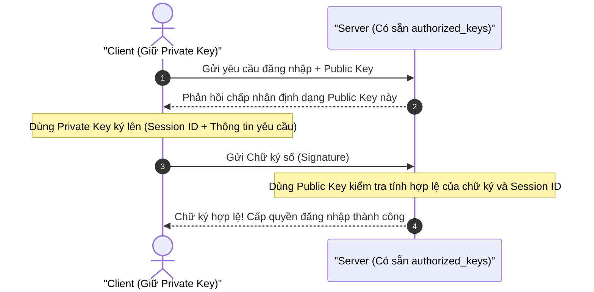
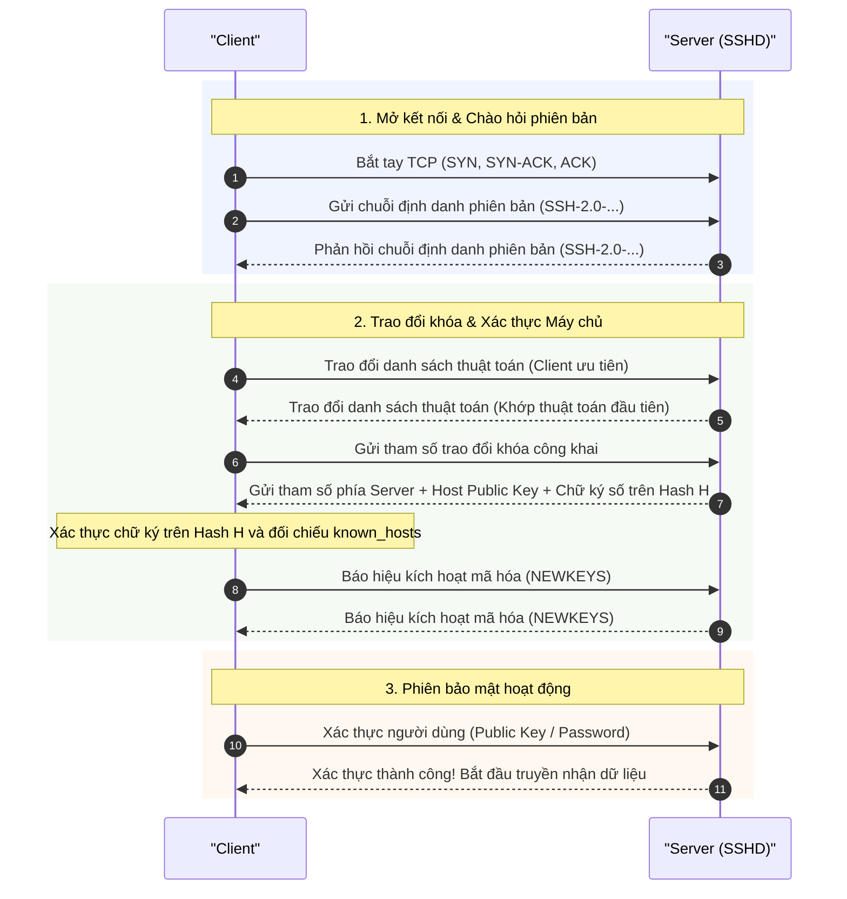
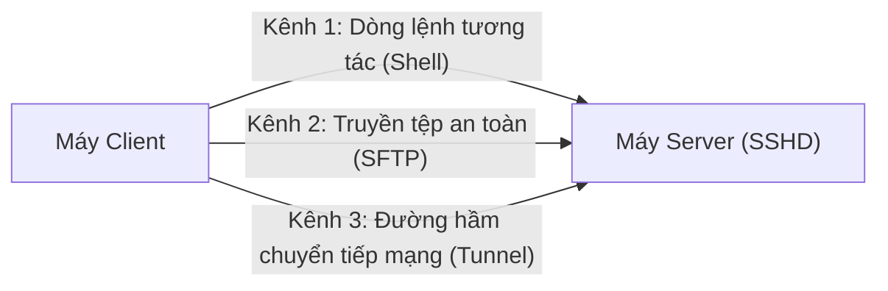

# Giao thức SSH (Secure Shell)

Khi quản trị một máy chủ từ xa qua mạng, nếu chúng ta truyền lệnh và mật khẩu ở dạng **plaintext** (như các giao thức cũ thời sơ khai), bất kỳ ai trên đường truyền cũng có thể đánh cắp toàn bộ quyền kiểm soát. Để giải quyết bài toán này, **SSH (Secure Shell)** ra đời như một tiêu chuẩn công nghiệp nhằm mã hóa toàn bộ phiên làm việc, hỗ trợ xác thực danh tính hai chiều và tạo các đường hầm truyền dữ liệu an toàn. Bài viết giải thích bản chất của SSH theo cách trực quan: vì sao cần SSH khi đã có TLS, kiến trúc 3 tầng, cơ chế xác thực máy chủ (TOFU), xác thực người dùng không cần truyền mật khẩu, luồng bắt tay và nguyên lý tạo đường hầm (Port Forwarding).

## Table of Contents

- [1. Vì sao đã có TLS/HTTPS vẫn cần SSH?](#1-vì-sao-đã-có-tlshttps-vẫn-cần-ssh)
- [2. Kiến trúc 3 tầng của SSH](#2-kiến-trúc-3-tầng-của-ssh)
- [3. Xác thực Máy chủ: Cơ chế TOFU và `known_hosts`](#3-xác-thực-máy-chủ-cơ-chế-tofu-và-known_hosts)
- [4. Xác thực Người dùng: Mật khẩu vs Public Key](#4-xác-thực-người-dùng-mật-khẩu-vs-public-key)
- [5. Luồng Bắt tay SSH (SSH Handshake)](#5-luồng-bắt-tay-ssh-ssh-handshake)
- [6. Ghép kênh và Tạo đường hầm (Port Forwarding)](#6-ghép-kênh-và-tạo-đường-hầm-port-forwarding)
- [7. Tiến hóa Mật mã học và Phòng thủ Tấn công](#7-tiến-hóa-mật-mã-học-và-phòng-thủ-tấn-công)
- [8. Tổng kết](#8-tổng-kết)

---

## 1. Vì sao đã có TLS/HTTPS vẫn cần SSH?

Cả TLS và SSH đều cung cấp 3 trụ cột an toàn thông tin: **Mã hóa (Confidentiality)**, **Xác thực (Authentication)**, và **Toàn vẹn dữ liệu (Integrity)**. Tuy nhiên, hai giao thức này giải quyết hai bài toán hoàn toàn khác nhau:

| Tiêu chí | **TLS / HTTPS** | **SSH (Secure Shell)** |
| :--- | :--- | :--- |
| **Mục đích thiết kế** | Truy cập web, gọi API (mô hình request - response ngắn hạn). | Điều khiển từ xa, mở terminal tương tác, truyền tệp, duy trì kết nối lâu dài. |
| **Đối tượng sử dụng** | Người dùng vãng lai, hàng triệu khách hàng công khai. | Kỹ sư, quản trị viên hệ thống có tài khoản định danh cụ thể trên server. |
| **Mô hình tin cậy Server** | **WebPKI tập trung:** Server mua chứng thư từ các tổ chức trung gian uy tín. Client tin server vì tin bên cấp chứng thư. | **TOFU phi tập trung:** Không phụ thuộc bên trung gian. Client tự lưu và ghi nhớ khóa của server sau lần gặp đầu tiên. |
| **Xác thực Client** | Mặc định client ẩn danh (rất ít khi yêu cầu xác thực ngược từ phía client). | Bắt buộc client phải chứng minh danh tính (qua mật khẩu hoặc khóa cá nhân) mới được cấp quyền thao tác. |

> [!NOTE]
> TLS giống như bạn bước vào một ngân hàng lớn: ngân hàng có giấy phép kinh doanh được nhà nước chứng nhận. Bạn không cần biết trước nhân viên là ai nhưng vẫn tin tưởng giao dịch.
> Còn SSH giống như bạn thuê chìa khóa vào một nhà kho riêng: bạn trực tiếp kiểm tra và ghi nhớ ổ khóa của nhà kho, đồng thời chỉ những ai cầm đúng chìa khóa riêng mới được mở cửa.

---

## 2. Kiến trúc 3 tầng của SSH

SSH không gộp tất cả tính năng vào một khối duy nhất mà chia công việc thành 3 tầng rõ ràng, xếp chồng lên nhau ngay trên nền TCP (cổng 22):

**Tầng 1: Transport Layer (Đào đường hầm bảo mật)**
Đây là lớp nền móng dưới cùng. Nhiệm vụ duy nhất của nó là biến một kết nối Internet trần trụi thành một "đường ống ngầm" tuyệt đối an toàn. Tại đây, client và server bắt tay nhau, tạo ra khóa chung để mã hóa dữ liệu, đồng thời kiểm tra xem máy chủ có đúng là máy chủ thật hay không qua khóa của máy chủ (Host Key). Khi tầng này hoàn tất, mọi gói tin đi qua đều đã được bảo vệ.

**Tầng 2: User Authentication (Hỏi giấy tờ tùy thân)**
Sau khi đã có đường hầm mã hóa an toàn ở tầng 1, tầng 2 bắt đầu làm việc để trả lời câu hỏi: *"Bạn là ai và có quyền đăng nhập vào máy chủ này không?"*. Bạn có thể xuất trình mật khẩu, dùng khóa định danh cá nhân, hoặc mã xác thực đa yếu tố. Nếu xác thực đúng, cửa máy chủ sẽ mở ra cho bạn.

**Tầng 3: Connection Layer (Chia làn đường truyền)**
Khi đã vào được bên trong, tầng 3 cho phép bạn chia một kết nối an toàn duy nhất thành nhiều làn đường độc lập (gọi là các Channels). Nhờ vậy, trên cùng một phiên làm việc, bạn vừa có thể tương tác dòng lệnh, vừa truyền file, lại vừa có thể mở đường hầm chuyển tiếp mạng mà các luồng không hề đá nhau.

---

## 3. Xác thực Máy chủ: Cơ chế TOFU và `known_hosts`

Làm sao bạn biết chắc chắn mình đang kết nối đến đúng máy chủ thật chứ không phải một kẻ giả mạo (Man-in-the-Middle) đang chặn đường?

### Khóa Máy chủ (Host Key) và Mã định danh (Fingerprint)

Mỗi máy chủ SSH khi cài đặt đều sở hữu các cặp khóa bất đối xứng định danh (thường gồm Ed25519, RSA, ECDSA, hoặc khóa hậu lượng tử như MLDSA):
- **Private Host Key:** Nằm tuyệt đối bí mật trên server.
- **Public Host Key:** Công khai cho mọi client kết nối đến.
- **Fingerprint:** Chuỗi mã băm ngắn gọn (mặc định là SHA-256 Base64) đại diện cho Public Host Key, giúp con người dễ dàng đối chiếu mắt thường khi cần kiểm tra.

### Mô hình TOFU (Trust On First Use)

Thay vì nhờ một bên thứ ba xác nhận, SSH sử dụng triết lý **Tin tưởng trong lần đầu tiên gặp gỡ**:

1. **Lần kết nối đầu tiên:** Client chưa từng thấy máy chủ này. Phần mềm sẽ hiển thị mã định danh (fingerprint) và hỏi bạn có tin tưởng máy chủ này để tiếp tục kết nối hay không.
2. **Lưu trữ niềm tin:** Khi bạn đồng ý, phần mềm sẽ tự động lưu cặp địa chỉ máy chủ và khóa công khai tương ứng vào danh sách tin cậy cục bộ trên máy (`known_hosts`).
3. **Các lần kết nối sau:** Mỗi khi kết nối, client tự động đối chiếu khóa nhận được từ máy chủ với danh sách đã lưu. Nếu trùng khớp, kết nối diễn ra ngay lập tức mà không cần hỏi lại.

> [!WARNING]
> **Điểm yếu của TOFU:** Nếu một kẻ tấn công đứng giữa đường truyền ngay trong *lần kết nối đầu tiên*, bạn có thể vô tình lưu nhầm khóa của kẻ tấn công.
> Còn nếu ở các lần kết nối sau, khóa của máy chủ bỗng nhiên thay đổi, hệ thống sẽ chặn đứng kết nối với cảnh báo:
> `@@@@@@@@@@@@@@@@@@@@@@@@@@@@@@@@@@@@@@@@@@@@@@@@@@@@@@@@@@@`
> `@    WARNING: REMOTE HOST IDENTIFICATION HAS CHANGED!     @`
> `@@@@@@@@@@@@@@@@@@@@@@@@@@@@@@@@@@@@@@@@@@@@@@@@@@@@@@@@@@@`
> Điều này cảnh báo: hoặc máy chủ vừa được cài đặt lại hệ điều hành, hoặc ai đó đang cố tình giả mạo máy chủ qua tấn công **Man-in-the-Middle (MITM)** để đánh cắp dữ liệu của bạn.

### Các biện pháp củng cố niềm tin cho TOFU

Trong môi trường doanh nghiệp hoặc hạ tầng quy mô lớn, việc phó mặc cho người dùng tự bấm "yes" ở lần kết nối đầu tiên tiềm ẩn rủi ro rất cao. Do đó, các kỹ sư thường kết hợp các cơ chế bảo vệ bổ sung:
- **Đối chiếu Fingerprint Out-of-band:** Kiểm tra mã băm qua một kênh độc lập đáng tin cậy (như bảng điều khiển web của nhà cung cấp Cloud, giao diện quản trị nội bộ) trước khi chấp nhận lưu vào `known_hosts`.
- **Cấu hình `StrictHostKeyChecking`:** Thiết lập `yes` để SSH client tự động từ chối kết nối nếu gặp máy chủ chưa từng có trong danh sách, buộc khóa phải được nạp trước (pre-seeded).
- **SSH Certificate Authority (`@cert-authority`):** Thay vì quản lý từng Host Key rời rạc, server được cấp một chứng thư ký bởi CA nội bộ. Client chỉ cần tin một khóa CA duy nhất trong `known_hosts` là có thể tự động xác thực danh tính của hàng nghìn server khác nhau mà không cần tin tưởng từng bước TOFU.
- **DNS SSHFP (RFC 4255):** Xuất bản bản ghi `SSHFP` (SSH Fingerprint) có chữ ký **DNSSEC** lên hệ thống tên miền. Client bật tùy chọn `VerifyHostKeyDNS` để tự động xác thực khóa máy chủ qua hạ tầng DNS an toàn.

---

## 4. Xác thực Người dùng: Mật khẩu vs Public Key

Khi đường hầm bảo mật đã thông và server đã được xác thực, server cần xác định bạn là ai và bạn có quyền truy cập hay không.

### Cách 1: Password Authentication (Dùng mật khẩu)

Bạn nhập mật khẩu tài khoản người dùng trên server:
- Mật khẩu được truyền qua đường hầm đã mã hóa của tầng Transport, nên kẻ nghe lén trên mạng không thể đọc trộm.
- **Hạn chế:** Máy chủ đích vẫn nhận được mật khẩu gốc ở dạng văn bản rõ. Nếu máy chủ bị kẻ xấu chiếm quyền điều khiển từ trước, mật khẩu của bạn có thể bị ghi lại. Ngoài ra, việc mở xác thực bằng mật khẩu ra Internet rất dễ trở thành mục tiêu của các cuộc tấn công dò quét tự động (Brute-force).

### Cách 2: Public Key Authentication (Xác thực không cần truyền mật khẩu)

Đây là chuẩn mực bảo mật cao nhất của SSH dựa trên nguyên lý mật mã bất đối xứng (RFC 4252):
- **Public Key:** Khóa công khai của bạn, được sao chép và lưu sẵn trong tệp `~/.ssh/authorized_keys` trên máy chủ.
- **Private Key:** Khóa riêng tư bí mật, luôn nằm an toàn trên thiết bị cá nhân của bạn, không bao giờ gửi cho bất kỳ ai.

Cơ chế xác thực này hoàn toàn do **client chủ động khởi xướng** (Client-initiated): Client không đợi server tạo số ngẫu nhiên, mà tự tạo một gói dữ liệu định danh phiên gồm `Session ID` (giá trị băm duy nhất gắn với phiên bắt tay vừa tạo) kết hợp với thông tin yêu cầu đăng nhập, sau đó dùng **Private Key** ký lên gói dữ liệu này và gửi sang server:

> [!TIP]
> **Điểm mấu chốt bảo mật:** Khóa riêng (**Private Key**) của bạn **hoàn toàn không rời khỏi máy tính cá nhân**. Việc gói dữ liệu ký bắt buộc phải chứa `Session ID` của phiên hiện tại ngăn chặn triệt để kẻ tấn công thu lại chữ ký số cũ để thực hiện tấn công phát lại (Replay Attack). Server chỉ cần dùng Public Key đối chiếu là chứng minh được chủ sở hữu hợp pháp.

---

## 5. Luồng Bắt tay SSH (SSH Handshake)

Quá trình bắt tay SSH diễn ra theo các bước tuần tự cực kỳ chặt chẽ:

1. **Bắt tay TCP (Port 22):** Hai bên mở kết nối mạng cơ bản để truyền nhận luồng byte.
2. **Chào hỏi phiên bản:** Hai bên gửi chuỗi định danh phiên bản dạng văn bản để xác nhận cùng sử dụng thế hệ giao thức tương thích (chuẩn mực là `SSH-2.0`).
3. **Thương lượng thuật toán:** Client và Server trao đổi danh sách thuật toán hỗ trợ theo cơ chế **Offer-list** (RFC 4253 §7.1): hệ thống duyệt lần lượt theo thứ tự ưu tiên trong danh sách của **Client** và chọn thuật toán đầu tiên xuất hiện mà **Server** cũng hỗ trợ.
4. **Trao đổi khóa & Xác thực Server:**
   - Client và Server thực hiện tính toán trao đổi khóa (như Diffie-Hellman hoặc ECDH/Curve25519) để sinh ra bí mật chung (**Shared Secret $K$**) mà không truyền trực tiếp qua mạng.
   - Cả hai bên tính toán giá trị băm trao đổi (**Exchange Hash $H$**) đại diện cho toàn bộ thông số và dữ liệu đã đàm phán trong quá trình bắt tay.
   - Server dùng **Host Private Key** ký lên giá trị băm $H$ này và gửi kèm **Host Public Key** cùng chữ ký số sang client.
   - Client kiểm tra chữ ký số bằng Public Key và đối chiếu Public Key nhận được với danh sách tin cậy (`known_hosts`).
5. **Kích hoạt mã hóa:** Cả hai bên trao đổi thông điệp báo hiệu hoàn tất (`SSH_MSG_NEWKEYS`). Toàn bộ thông tin trao đổi từ thời điểm này trở đi đều được mã hóa đối xứng và bảo vệ tính toàn vẹn.
6. **Xác thực người dùng:** Client thực hiện đăng nhập (bằng khóa công khai hoặc mật khẩu) trên kênh đã mã hóa. Sau khi server phê duyệt, phiên làm việc an toàn chính thức hoạt động.

---

## 6. Ghép kênh và Tạo đường hầm (Port Forwarding)

Một trong những sức mạnh lớn nhất của SSH là tính năng **ghép kênh (Multiplexing)** và **tạo đường hầm (Tunneling)**. Trên một kết nối TCP duy nhất, bạn có thể mở đồng thời nhiều kênh độc lập:

### Các mô hình tạo đường hầm phổ biến

#### 1. Chuyển tiếp cổng Cục bộ (Local Forwarding: `-L`)
- **Bài toán:** Máy chủ đích của bạn đang chạy một dịch vụ nội bộ (ví dụ: Database PostgreSQL cổng 5432) chỉ lắng nghe trên giao diện cục bộ `127.0.0.1` và không mở cổng ra ngoài Internet. Bạn ngồi ở máy cá nhân muốn truy cập vào Database này mà không làm giảm tính bảo mật của server.
- **Giải pháp:** Thiết lập đường hầm cục bộ. Bạn mở một cổng chờ (ví dụ: `127.0.0.1:5432`) ngay trên máy cá nhân của mình. Dữ liệu gửi vào cổng này được SSH đóng gói mã hóa, gửi qua kết nối SSH tới server, rồi `sshd` đứng ra chuyển tiếp kết nối vào `localhost:5432` của server.
- **Lưu ý thực tế:** Nhìn từ phía Database, các kết nối đều xuất phát từ chính `sshd` cục bộ trên server (`127.0.0.1`), chứ không phải từ địa chỉ IP của máy cá nhân. Cổng mở trên máy bạn mặc định chỉ bind vào giao diện loopback cục bộ để đảm bảo an toàn.

#### 2. Chuyển tiếp cổng Từ xa (Remote Forwarding: `-R`)
- **Bài toán:** Bạn đang phát triển một ứng dụng web thử nghiệm trên máy tính cá nhân (cổng 3000) và muốn đồng nghiệp bên ngoài mạng Internet truy cập trực tiếp để duyệt thử, dù máy bạn nằm sau router gia đình và không có IP công khai.
- **Giải pháp:** Thiết lập đường hầm từ xa. Bạn mở kết nối SSH tới một máy chủ công khai trên đám mây và yêu cầu máy chủ đó mở một cổng (ví dụ: 8080) để đón khách. Mọi truy cập vào cổng 8080 trên server sẽ được chuyển ngược về cổng 3000 trên máy cá nhân qua đường hầm SSH.
- **Cảnh báo quan trọng về `GatewayPorts`:** Theo mặc định trong cấu hình `sshd_config(5)`, tùy chọn `GatewayPorts` được đặt là `no`. Điều này khiến `sshd` **chỉ gắn cổng remote vào giao diện loopback (`127.0.0.1`) của máy chủ**, dẫn đến việc người ngoài Internet truy cập vào `server_ip:8080` sẽ bị từ chối kết nối. Để cho phép máy ngoài truy cập, quản trị viên bắt buộc phải cấu hình `GatewayPorts clientspecified` (an toàn nhất) và client chỉ định bind địa chỉ khi mở đường hầm, hoặc bật `GatewayPorts yes` trên máy chủ.

#### 3. Chuyển tiếp cổng Động (Dynamic Forwarding / SOCKS Proxy: `-D`)
- **Bài toán:** Bạn đang kết nối vào một mạng Wi-Fi công cộng không an toàn và muốn mã hóa toàn bộ lưu lượng web, hoặc muốn vượt qua tường lửa giới hạn mà không cần cấu hình thủ công từng cổng riêng rẽ.
- **Giải pháp:** Thiết lập đường hầm động. Client SSH mở một cổng chờ trên máy cá nhân đóng vai trò là một **SOCKS5 Proxy**. Bạn chỉ cần trỏ cấu hình mạng của ứng dụng (như trình duyệt web) vào cổng này, toàn bộ yêu cầu kết nối sẽ được đóng gói mã hóa gửi qua server SSH rồi mới định tuyến ra ngoài Internet.
- **Nguy cơ rò rỉ DNS (DNS Leak):** SOCKS proxy chỉ che giấu dữ liệu tầng ứng dụng nếu ứng dụng được cấu hình định tuyến cả truy vấn DNS qua proxy (sử dụng giao thức `socks5h://` hoặc bật tùy chọn *Proxy DNS when using SOCKS v5*). Nếu không, các truy vấn phân giải tên miền vẫn bị gửi lộ thiên ra mạng Wi-Fi hiện tại thông qua DNS resolver cục bộ.

---

## 7. Tiến hóa Mật mã học và Phòng thủ Tấn công

Giao thức SSH liên tục phát triển nhằm đối phó với những biến chuyển công nghệ và kỹ thuật tấn công mới:

### 1. Xu hướng Thuật toán Hiện đại và Điện toán Lượng tử
- **Các thuật toán truyền thống:** Trước đây hệ thống chủ yếu dựa vào thuật toán mã hóa khóa công khai cổ điển (như RSA, DSA). Thuật toán DSA hiện đã bị loại bỏ hoàn toàn trong các phiên bản OpenSSH hiện đại (kể từ OpenSSH 10.0), trong khi RSA kích thước nhỏ bị hạn chế do hiệu năng kém và rủi ro dài hạn.
- **Thuật toán đường cong elliptic hiện đại:** Các phiên bản hiện đại ưu tiên sử dụng họ thuật toán đường cong elliptic (như dòng họ Ed25519 cho chữ ký số, ECDH/X25519 cho trao đổi khóa) và các bộ mã hóa khối đối xứng có xác thực toàn vẹn (như dòng họ ChaCha20-Poly1305 và AES-GCM). Chúng mang lại tốc độ vượt trội, kích thước khóa nhỏ gọn và khả năng kháng tấn công kênh bên (Side-channel Attack).
- **Phòng vệ trước máy tính lượng tử:** Để đối phó với nguy cơ kẻ tấn công ghi lại dữ liệu hôm nay để giải mã bằng máy tính lượng tử trong tương lai ("Harvest Now, Decrypt Later"), các phiên bản OpenSSH hiện đại (bắt đầu từ bản 9.0 và hoàn thiện với chuẩn kết hợp mới trong các bản kế tiếp) đã kích hoạt mặc định cơ chế trao đổi khóa lai hậu lượng tử. Sự kết hợp giữa thuật toán truyền thống và thuật toán kháng lượng tử đảm bảo kết nối vẫn an toàn ngay cả khi một trong hai thuật toán bị bẻ khóa.

### 2. Tấn công Terrapin và Cơ chế Bắt tay Chặt chẽ (Strict KEX)
- **Bản chất lỗ hổng (Terrapin Attack):** Lỗ hổng an ninh mạng công bố cuối năm 2023 chỉ ra rằng kẻ tấn công Man-in-the-Middle có thể làm suy giảm tính toàn vẹn của giai đoạn bắt tay nếu kết hợp **hai nguyên nhân gốc rễ**:
  1. Giao thức cho phép một số gói tin không trọng yếu (như gói tin bỏ qua hoặc gỡ lỗi) xuất hiện mà không được xác thực chặt chẽ trong Exchange Hash $H$.
  2. Số thứ tự gói tin (Sequence Number) được duy trì ngầm định liên tục và không được làm mới về 0 khi chuyển trạng thái sang đường truyền mã hóa.
- **Phạm vi ảnh hưởng:** Tấn công chỉ đe dọa các kết nối sử dụng chế độ mã hóa ChaCha20-Poly1305 hoặc các chế độ CBC kết hợp cơ chế Encrypt-then-MAC (CBC-EtM). Ngược lại, **bộ mã hóa AES-GCM hoàn toàn miễn nhiễm** trước Terrapin do cơ chế xử lý số thứ tự gói tin độc lập.
- **Biện pháp khắc phục (Strict KEX):** Cơ chế bắt tay chặt chẽ được các nhà phát triển đưa vào như một tiện ích mở rộng đàm phán bắt tay:
  - Bắt buộc đặt lại số thứ tự gói tin về 0 ngay khi kích hoạt mã hóa (`SSH_MSG_NEWKEYS`).
  - Lập tức chấm dứt phiên kết nối nếu phát hiện bất kỳ gói tin không mong muốn nào xuất hiện trong giai đoạn bắt tay.
  - *Lưu ý:* Cơ chế Strict KEX tự động được kích hoạt khi cả Client và Server đều hỗ trợ phần mở rộng này. Nếu một trong hai bên là máy chủ/máy khách phiên bản cũ, phiên kết nối vẫn tiềm ẩn nguy cơ nếu tiếp tục sử dụng các bộ mật mã dễ bị tổn thương.

---

## 8. Tổng kết

- **Bản chất của SSH:** Tiêu chuẩn vàng cho quản trị máy chủ từ xa, tương tác dòng lệnh và tạo đường hầm truyền dữ liệu bảo mật trên cổng 22.
- **Khác biệt với TLS:** TLS dựa vào mô hình chứng thư số tập trung phục vụ web đại trà; SSH dựa vào cơ chế ghi nhớ khóa cục bộ (TOFU) phục vụ quyền quản trị chuyên biệt.
- **Kiến trúc 3 tầng:** Tách bạch giữa tầng đường hầm mã hóa (**Transport**), tầng xác định quyền người dùng (**User Auth**), và tầng chia luồng làm việc song song (**Connection**).
- **Public Key Authentication:** Cơ chế do Client chủ động khởi xướng: chứng minh danh tính bằng chữ ký số trên Session ID mà khóa riêng (**Private Key**) không bao giờ rời khỏi thiết bị cá nhân.
- **Đường hầm linh hoạt:** Khả năng chuyển tiếp cổng mạng (Local, Remote, Dynamic) hỗ trợ truy cập an toàn dịch vụ nội bộ, chia sẻ ứng dụng và bảo vệ lưu lượng duyệt web — cần lưu ý cấu hình `GatewayPorts` và phòng tránh rò rỉ DNS.
- **Tiến hóa bảo mật:** Chuyển dịch sang các họ thuật toán đường cong elliptic hiện đại, sẵn sàng trao đổi khóa lai hậu lượng tử, đồng thời vá các lỗ hổng bắt tay như Terrapin bằng cơ chế Strict KEX.

---

## Liên quan

*   [Giao thức TLS (Transport Layer Security)](./tls.md) — Đối chiếu nguyên lý trao đổi khóa Diffie-Hellman và sự khác biệt giữa mô hình tin cậy tập trung (WebPKI CA) với mô hình phi tập trung (TOFU).
*   [Giao thức HTTPS](./https.md) — Tìm hiểu cách TLS kết hợp cùng HTTP để bảo vệ ứng dụng web công khai thay vì điều khiển máy chủ tương tác như SSH.

---
[← Back to README](../README.md)