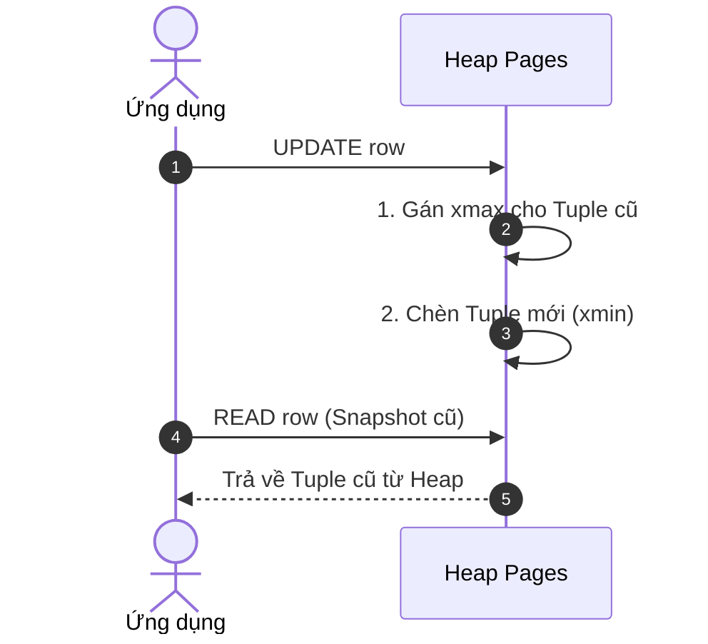
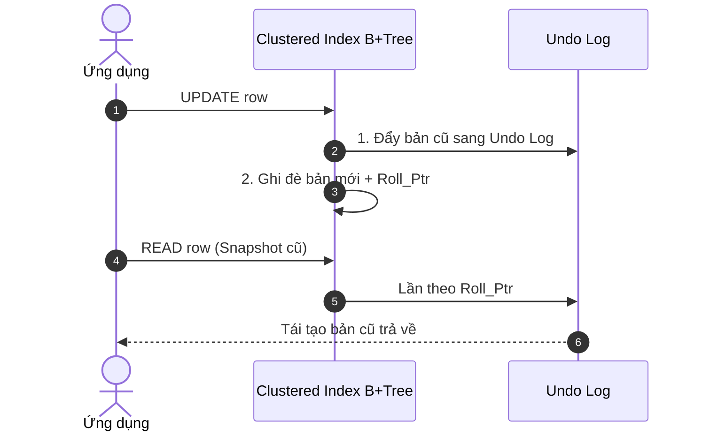

# Chương 1. MVCC — Multi-Version Concurrency Control

## Table of Contents

- [Sự Bế Tắc của Kỷ Nguyên Khóa 2PL](#sự-bế-tắc-của-kỷ-nguyên-khóa-2pl)
- [Bản Chất MVCC: Tách Biệt Trạng Thái Dữ Liệu Theo Thời Gian](#bản-chất-mvcc-tách-biệt-trạng-thái-dữ-liệu-theo-thời-gian)
- [Hai Ngả Đường Kiến Trúc: Append-Only Heap và In-Place Undo Log](#hai-ngả-đường-kiến-trúc-append-only-heap-và-in-place-undo-log)
- [Hành Trình Dọn Rác: Tiến Hóa Của VACUUM và Thách Thức Undo Purge](#hành-trình-dọn-rác-tiến-hóa-của-vacuum-và-thách-thức-undo-purge)
- [Cấp Độ Cô Lập: Cơ Chế Snapshot và Kiểm Soát Phantom Read](#cấp-độ-cô-lập-cơ-chế-snapshot-và-kiểm-soát-phantom-read)
- [Tổng Kết](#tổng-kết)

---

## Sự Bế Tắc của Kỷ Nguyên Khóa 2PL

Trong giai đoạn đầu của các hệ quản trị cơ sở dữ liệu quan hệ, việc bảo toàn các đặc tính ACID phụ thuộc hoàn toàn vào cơ chế kiểm soát tương tranh dựa trên khóa bi quan. Nền tảng của phương pháp này là mô hình **Single-Version**: mỗi thực thể dữ liệu chỉ sở hữu duy nhất một vị trí vật lý trên đĩa cũng như trong bộ đệm, và mọi thao tác cập nhật đều trực tiếp ghi đè lên chính bản ghi đó.

Chính vì chỉ tồn tại một phiên bản dữ liệu duy nhất, hệ thống buộc phải triển khai giao thức **Strict 2PL** để đảm bảo tính tuần tự hóa giữa các transaction chạy song song. Quy tắc xung đột bất khả kháng giữa **S-Lock** và **X-Lock** đã tạo ra một rào cản vận hành nan giải:

**"Reader blocks Writer, Writer blocks Reader"**

Hệ quả là các luồng xử lý liên tục ghìm chân nhau. Khi một transaction chạy truy vấn báo cáo kéo dài trên một tập dữ liệu lớn, việc giữ **S-Lock** trên hàng loạt trang dữ liệu sẽ buộc mọi thao tác cập nhật song song phải dừng lại chờ đợi. Ngược lại, một thao tác ghi dù chỉ cập nhật một dòng ngắn ngủi cũng chiếm giữ **X-Lock**, đình trệ toàn bộ các câu lệnh đọc hướng tới tài nguyên đó.

Khi mật độ truy cập và quy mô dữ liệu mở rộng, sự tranh chấp khóa bi quan làm suy giảm nghiêm trọng thông lượng xử lý song song, gia tăng độ trễ và đẩy hệ thống vào nguy cơ **Deadlock** thường trực. Toàn bộ hiệu năng của cơ sở dữ liệu khi đó bị giới hạn bởi thời gian thực thi của transaction dài nhất — đòi hỏi ngành công nghiệp phải tìm kiếm một hướng đi hoàn toàn mới.

---

## Bản Chất MVCC: Tách Biệt Trạng Thái Dữ Liệu Theo Thời Gian

Để phá vỡ hoàn toàn thế bế tắc "đọc chặn ghi, ghi chặn đọc" của kỷ nguyên khóa bi quan, kiến trúc **MVCC** đã ra đời dựa trên một tuyên ngôn đối lập:

**"Readers never block Writers, and Writers never block Readers"**

Đột phá cốt lõi của MVCC nằm ở việc tách biệt không gian trạng thái của dữ liệu theo trục thời gian. Thay vì ép buộc mọi transaction phải nhìn vào một phiên bản dữ liệu vật lý duy nhất tại thời điểm hiện tại, storage engine cho phép nhiều phiên bản khác nhau của cùng một bản ghi đồng thời tồn tại trong hệ thống.

Nhờ sự đa phiên bản này, luồng ghi và luồng đọc được tách rời hoàn toàn về mặt tài nguyên:
* **Khi ghi dữ liệu:** Hệ thống không ghi đè trực tiếp mà sinh ra một phiên bản dữ liệu mới mang dấu ấn thời gian tương ứng.
* **Khi đọc dữ liệu:** Các câu lệnh truy vấn được định tuyến tới một ảnh chụp dữ liệu nhất quán (Consistent Snapshot), phản ánh chính xác trạng thái cơ sở dữ liệu tại mốc thời gian transaction bắt đầu.

Sự tách biệt này mang lại lợi ích kép: tiến trình đọc hoàn toàn không cần cấp phát khóa đọc nên không thể phong tỏa tiến trình ghi; đồng thời, thao tác ghi cũng tự do cập nhật mà không làm gián đoạn hay sai lệch tầm nhìn của các tiến trình đọc đang diễn ra. Tuy nhiên, dù cùng chung mục tiêu giải phóng luồng đọc khỏi luồng ghi, các nhà thiết kế cơ sở dữ liệu lại đứng trước bài toán hóc búa: Lưu trữ các phiên bản dữ liệu này ở đâu và như thế nào?

---

## Hai Ngả Đường Kiến Trúc: Append-Only Heap và In-Place Undo Log

Chính câu hỏi về vị trí lưu trữ các phiên bản cũ đã dẫn dắt hai hệ quản trị cơ sở dữ liệu mã nguồn mở phổ biến nhất rẽ sang hai hướng tiếp cận hoàn toàn trái ngược:

### PostgreSQL: Mô Hình "Never Overwrite" (1986 — Michael Stonebraker)

Được khởi xướng bởi Michael Stonebraker tại Đại học California, Berkeley, dự án POSTGRES được xây dựng trên nguyên tắc: không bao giờ ghi đè lên dữ liệu cũ. Ý tưởng ban đầu hướng tới việc lưu giữ toàn bộ lịch sử biến đổi của bản ghi ngay trong không gian bảng chính để phục vụ các truy vấn xuyên thời gian và hỗ trợ phục hồi sau sự cố tức thì.

Sơ đồ tuần tự mô tả luồng `UPDATE` và `READ` trong kiến trúc Append-Only Heap của PostgreSQL:

Nguyên tắc này định hình nên kiến trúc Append-Only Heap:
* **Không gian lưu trữ:** Bảng dữ liệu là một tập hợp các trang Heap không có thứ tự vật lý. Cả phiên bản dữ liệu mới lẫn phiên bản dữ liệu cũ đều nằm chung trong các trang Heap này.
* **Cơ chế ghi:** Thao tác thêm mới tạo ra một bản ghi trong Heap. Thao tác xóa không loại bỏ bản ghi mà chỉ gắn nhãn giao dịch đã xóa. Đặc biệt, thao tác cập nhật thực chất là một chuỗi hành động kép: đánh dấu xóa phiên bản cũ và chèn thêm một phiên bản hoàn toàn mới vào vị trí khả dụng tiếp theo trong Heap.
* **Truy xuất lịch sử:** Mỗi bản ghi mang thông tin định danh của transaction tạo ra nó (`xmin`) và transaction xóa nó (`xmax`). Khi đọc dữ liệu, engine đối chiếu thông tin này với Snapshot của transaction để quyết định xem bản ghi đó có thuộc về không gian hiển thị hợp lệ hay không.

### MySQL InnoDB: Mô Hình "In-Place Update with Undo Log" (~2001 — Heikki Tuuri)

Trái ngược với triết lý bảo tồn lịch sử của PostgreSQL, Heikki Tuuri thiết kế storage engine InnoDB nhắm thẳng vào các bài toán xử lý giao dịch trực tuyến (OLTP) thương mại — nơi thông lượng cập nhật cực cao và dung lượng đĩa của bảng chính cần được giữ ổn định tối đa.

Sơ đồ tuần tự mô tả luồng `UPDATE` và `READ` trong kiến trúc In-Place Update kết hợp Undo Log của InnoDB:

InnoDB hiện thực hóa mục tiêu này bằng kiến trúc In-Place Update kết hợp Undo Log:
* **Không gian lưu trữ:** Bảng dữ liệu được tổ chức dưới dạng Clustered Index (cây B+Tree sắp xếp theo Khóa Chính). Dữ liệu thực tế của các cột luôn nằm cố định tại các trang lá của cây.
* **Cơ chế ghi:** Khi một bản ghi được cập nhật, InnoDB ghi đè trực tiếp dữ liệu mới lên vị trí vật lý của dòng đó trên B+Tree. Toàn bộ dữ liệu cũ trước khi bị sửa đổi được chuyển sang một không gian lưu trữ riêng biệt gọi là Undo Log.
* **Truy xuất lịch sử:** Bản ghi trên B+Tree lưu định danh transaction sửa đổi gần nhất và một con trỏ ngược trỏ vào Undo Log. Nếu nhiều lần cập nhật liên tiếp diễn ra, các bản ghi trong Undo Log sẽ liên kết ngược lại với nhau tạo thành một Version Chain (chuỗi phiên bản). Thao tác đọc nếu thấy bản ghi hiện tại trên B+Tree quá mới so với snapshot của mình sẽ lần theo Version Chain trong Undo Log để tái tạo lại trạng thái dữ liệu trong quá khứ.

Sự khác biệt căn bản về nơi cất giữ phiên bản cũ — một bên để chung trong bảng chính, một bên dồn sang vùng nhớ riêng — đã trực tiếp dẫn đến hai bài toán dọn dẹp dữ liệu rác hoàn toàn khác nhau.

---

## Hành Trình Dọn Rác: Tiến Hóa Của VACUUM và Thách Thức Undo Purge

Dữ liệu cũ sau khi không còn transaction nào cần đọc tới sẽ trở thành rác. Cơ chế dọn dẹp lượng rác này chính là thước đo độ phức tạp trong vận hành thực tế của cả hai kiến trúc.

### PostgreSQL: Thách Thức Dead Tuples và Hành Trình Tiến Hóa VACUUM

Do các phiên bản dữ liệu cũ (Dead Tuples) nằm xen kẽ trực tiếp với dữ liệu sống trên các trang Heap, PostgreSQL phải đối mặt với nguy cơ phân mảnh và phình bảng (Table Bloat). Nếu không được giải phóng kịp thời, bảng dữ liệu và các chỉ mục phụ sẽ phình to mất kiểm soát. Để giải quyết, PostgreSQL sử dụng tiến trình dọn dẹp ngầm mang tên VACUUM.

Từng là gánh nặng vận hành lớn do tiêu tốn tài nguyên đĩa I/O, kiến trúc VACUUM đã liên tục tiến hóa qua các phiên bản để đáp ứng hạ tầng phần cứng hiện đại:
* **PostgreSQL 13 (Parallel Index Vacuum):** Kích hoạt nhiều luồng chạy song song để quét và dọn dẹp các chỉ mục phụ độc lập, cắt giảm mạnh thời gian khóa logic trên các bảng có nhiều chỉ mục.
* **PostgreSQL 14 (Bottom-Up Index Deletion):** Cải tiến thuật toán trên các trang lá của chỉ mục B-Tree, cho phép trang chủ động dọn dẹp các con trỏ trỏ tới dead tuples ngay khi trang sắp đầy, chặn đứng hiện tượng phình chỉ mục từ sớm trước khi tiến trình định kỳ can thiệp.
* **PostgreSQL 16 (Tối ưu hóa Buffer Ring và Thang chi phí):** Mở rộng giới hạn bộ đệm chuyên dụng và tái cấu trúc thang đo chi phí I/O nhằm khai thác triệt để băng thông của các ổ cứng SSD/NVMe thế hệ mới.
* **PostgreSQL 17 (Cấu trúc Bộ nhớ Radix Tree - TidStore):** Thay thế toàn bộ mảng phẳng tĩnh lưu trữ danh sách các con trỏ bản ghi chết bằng cấu trúc cây tiền tố thích ứng (Adaptive Radix Tree). Cải tiến này giúp tiết kiệm tới 95% bộ nhớ RAM, xóa bỏ hoàn toàn mức trần bộ nhớ 1 GB trước đây và chấm dứt tình trạng quét chỉ mục nhiều vòng (Multi-pass Index Vacuuming) trên các bảng dữ liệu khổng lồ.

### MySQL InnoDB: Purge Threads và Hiểm Họa Từ Long-Running Transactions

Trong khi PostgreSQL phải giải quyết bài toán rác nằm rải rác trong Heap, InnoDB lại giải phóng bảng chính khỏi rác bằng cách đẩy toàn bộ gánh nặng sang Undo Log, giao việc thu dọn cho các luồng xử lý ngầm gọi là Purge Threads.

Quy trình dọn dẹp của InnoDB diễn ra như sau:
1. Khi một bản ghi bị xóa, InnoDB chỉ đánh dấu cờ xóa tạm thời (delete mark) trên cây B+Tree.
2. Purge Threads quét ngầm định kỳ và xác định một ranh giới an toàn toàn cục gọi là Purge Horizon (tương ứng với transaction cổ nhất vẫn đang hoạt động).
3. Mọi bản ghi trong Undo Log nằm sau mốc Purge Horizon sẽ được giải phóng, và bản ghi bị đánh dấu xóa trên B+Tree mới chính thức bị gỡ bỏ vật lý.

Tuy nhiên, cơ chế này lại có một "gót chân Achilles": **Long-running Transactions**. Nếu một transaction tồn tại kéo dài, nó sẽ ghìm chặt Purge Horizon lại quá khứ, kéo theo hai hệ lụy nghiêm trọng:
* **Undo Bloat:** Toàn bộ các bản ghi Undo Log sinh ra sau thời điểm transaction đó mở đều không thể dọn dẹp, khiến không gian đĩa bị chiếm dụng hàng chục gigabytes.
* **Hiệu năng đọc sụp đổ:** Chuỗi **Version Chain** bị kéo dài vô tận. Khi các truy vấn đọc khác quét qua những dòng bị sửa đổi nhiều lần, chúng buộc phải lội ngược hàng triệu mắt xích Undo để chắp vá lại trạng thái cũ, gây suy giảm hiệu năng nghiêm trọng.

Sự khác biệt trong việc quản lý Snapshot và dữ liệu cũ này không dừng lại ở tầng lưu trữ, mà còn chi phối trực tiếp đến cách hai hệ thống hiện thực hóa các cấp độ cô lập giao dịch.

---

## Cấp Độ Cô Lập: Cơ Chế Snapshot và Kiểm Soát Phantom Read

Trên nền tảng MVCC, cả hai engine đều triển khai các cấp độ cô lập (Isolation Levels) theo chuẩn ANSI SQL, nhưng triết lý thiết kế khác biệt đã tạo nên những hành vi vận hành rất riêng.

### 1. Khác Biệt Mặc Định Mang Tính Lịch Sử
* **PostgreSQL chọn mặc định là READ COMMITTED:** Mỗi câu truy vấn SQL riêng biệt bên trong transaction đều chụp một Snapshot mới. Cách tiếp cận này tối ưu hóa tính tức thời của dữ liệu và đẩy thông lượng xử lý song song lên mức cao nhất.
* **MySQL InnoDB chọn mặc định là REPEATABLE READ:** Một **Read View** duy nhất được tạo ra ngay tại câu lệnh đọc đầu tiên và tái sử dụng xuyên suốt toàn bộ transaction. Lựa chọn này xuất phát từ yêu cầu tương thích với cơ chế nhân bản dữ liệu theo câu lệnh (**Statement-based Binary Logging**) của MySQL thời kỳ đầu, đòi hỏi các transaction phải tái hiện dữ liệu theo đúng thứ tự tuần tự trên các máy chủ Replica.

### 2. Xử Lý Hiện Tượng Phantom Read tại Repeatable Read
Hiện tượng Phantom Read xuất hiện khi một truy vấn đọc lặp lại trên một khoảng dữ liệu bỗng thấy thêm các dòng mới do transaction khác vừa chèn vào. Hai engine đối phó với hiện tượng này theo hai triết lý trái ngược:
* **PostgreSQL dựa thuần túy vào Snapshot Isolation:** Nhờ Snapshot đóng băng mốc thời gian từ đầu, các bản ghi mới chèn mang định danh giao dịch nằm ngoài tầm nhìn của Snapshot sẽ mặc nhiên vô hình. PostgreSQL triệt tiêu hoàn toàn Phantom Read trên luồng đọc dữ liệu mà không cần cấp phát bất kỳ một chiếc khóa nào.
* **MySQL InnoDB kết hợp MVCC và Next-Key Locking:** Với các câu lệnh đọc không khóa (**Snapshot Read**), InnoDB dùng Read View để chặn Phantom Read. Tuy nhiên, với các câu lệnh đọc có khóa hoặc thao tác sửa đổi (`SELECT ... FOR UPDATE`, `UPDATE`, `DELETE` — **Current Read**), MVCC bị vô hiệu hóa. InnoDB buộc phải kích hoạt cơ chế **Next-Key Locking** (kết hợp **Record Lock** và **Gap Lock**). Bất kỳ transaction nào muốn chèn dòng mới vào khoảng trống đang bị khóa đều bị chặn cứng, đổi lại là nguy cơ tranh chấp và Deadlock gia tăng.

### 3. Cấp Độ Cao Nhất: Serializable
* **PostgreSQL triển khai SSI:** Áp dụng kỹ thuật theo dõi đồ thị phụ thuộc giữa các giao dịch trong bộ nhớ (**SIREAD Locks**) một cách hoàn toàn phi khóa. Đọc không bao giờ chặn ghi. Nếu phát hiện nguy cơ vi phạm tính tuần tự hóa (chẳng hạn như hiện tượng **Write Skew**), engine sẽ chủ động hủy bỏ (**abort**) một transaction xung đột để bảo vệ tính nhất quán.
* **MySQL InnoDB quay về Strict 2PL:** InnoDB từ bỏ hoàn toàn ưu thế của MVCC đối với luồng đọc. Toàn bộ các câu lệnh đọc thông thường được tự động ép thành đọc có **S-Lock**. Hệ thống quay trở lại trọn vẹn hành vi của kỷ nguyên Single-Version: đọc chặn ghi và ghi chặn đọc.

---

## Tổng Kết

Sự tiến hóa của MVCC khẳng định một chân lý bất biến trong kỹ thuật hệ thống: không tồn tại một kiến trúc hoàn hảo cho mọi nhu cầu, mà chỉ có sự cân bằng có chủ đích giữa các chiều đánh đổi.

| Tiêu Chí So Sánh | PostgreSQL (Append-Only Heap) | MySQL InnoDB (In-Place + Undo Log) |
| :--- | :--- | :--- |
| **Vị Trí Bản Ghi Cũ** | Nằm trực tiếp trong Heap cùng bản ghi mới | Tách riêng vào Undo Tablespace |
| **Thao Tác UPDATE** | Ghi mới + Đánh dấu xóa cũ (Chi phí ghi cao hơn) | Ghi đè tại chỗ + Ghi Undo Log (Chi phí ghi tối ưu) |
| **Gánh Nặng Dọn Dẹp** | Phân mảnh bảng chính $\to$ Cần VACUUM liên tục | Phình Undo Log $\to$ Nhạy cảm với Long Transactions |
| **Chiến Lược Serializable** | SSI phi khóa (Lạc quan, theo dõi phụ thuộc) | Strict 2PL (Bi quan, đọc ép lấy S-Lock) |

Triết lý của Michael Stonebraker trên PostgreSQL chấp nhận sự phức tạp trong việc dọn dẹp rác ở bảng chính để đổi lấy sự tự do tuyệt đối của các luồng đọc và khả năng hủy giao dịch tức thì. Ngược lại, lựa chọn của Heikki Tuuri trên InnoDB bảo vệ sự tinh gọn của cấu trúc B+Tree bảng chính bằng cách dồn toàn bộ gánh nặng lịch sử vào Undo Log. Hiểu rõ bản chất của hai ngả đường kiến trúc này chính là chìa khóa để thiết kế, tối ưu hóa và làm chủ hiệu năng của các hệ cơ sở dữ liệu quy mô lớn.

---

[← Back to README](README.md)